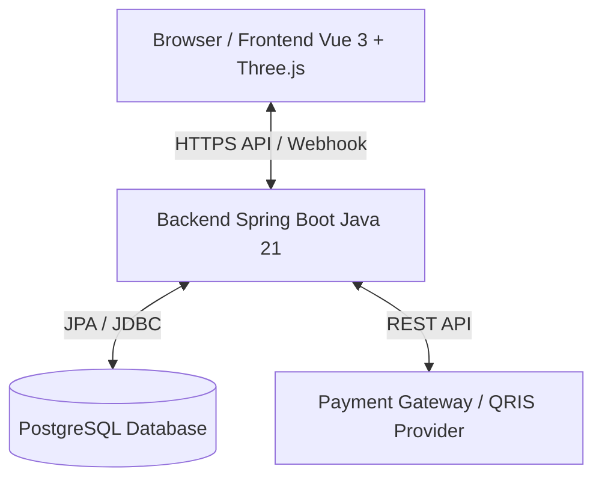
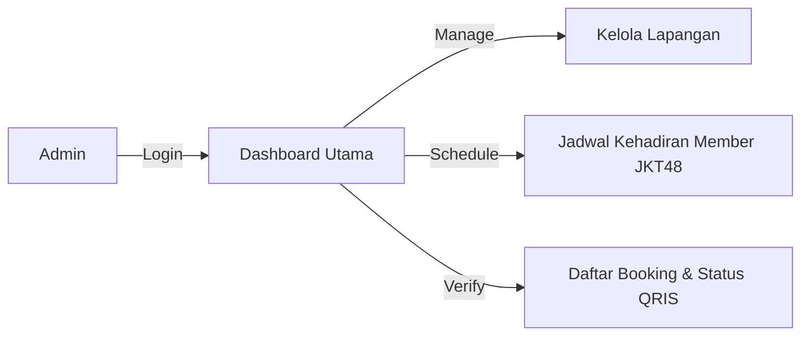
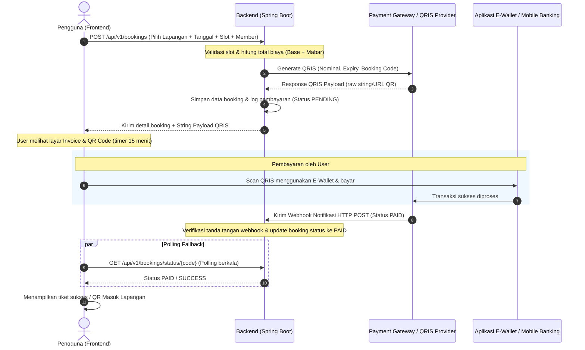

# Product Requirement Document (PRD) - Padel48 🎾✨

Dokumen ini mendefinisikan persyaratan produk, spesifikasi teknis, arsitektur database, dan alur integrasi sistem untuk **Padel48**, sebuah platform digital inovatif untuk pemesanan (*booking*) lapangan padel premium dengan nilai keunikan utama: kesempatan bermain bersama member **JKT48**.

---

## 📖 1. Latar Belakang & Visi Produk

Olahraga padel mengalami peningkatan popularitas yang pesat di Indonesia. Di sisi lain, ekosistem penggemar JKT48 memiliki loyalitas dan tingkat keterlibatan (*engagement*) yang sangat tinggi. **Padel48** hadir sebagai jembatan yang menggabungkan gaya hidup sehat melalui olahraga padel dengan pengalaman interaksi eksklusif bersama member JKT48 secara sportif dan menyenangkan.

### Visi Utama
Menjadi platform pemesanan padel hub nomor satu yang tidak hanya menyediakan fasilitas olahraga berkualitas tinggi tetapi juga menyajikan pengalaman hiburan (*sportainment*) eksklusif yang aman, terorganisir, dan berkesan bagi para fans JKT48 dan pecinta olahraga.

---

## 🛠️ 2. Arsitektur & Teknologi

Sistem dibangun menggunakan pendekatan modern yang memisahkan antara presentasi (Frontend 3D-Interactive) dan logika bisnis serta data (Backend & Database).



### Komponen Teknologi
*   **Frontend**: 
    *   **Vue 3 (Vite)**: Framework utama untuk reaktivitas UI dan struktur komponen SPA (*Single Page Application*).
    *   **Three.js & TresJS (Vue 3 Declarative Three.js)**: Untuk me-render visualisasi 3D interaktif pada Landing Page dan Menu Utama.
    *   **Tailwind CSS**: Framework CSS utama dengan arsitektur utility-first yang dikonfigurasi secara kustom dan mengikuti praktik terbaik (*best practices*).
    *   **Pinia**: State Management untuk menyimpan data sesi booking, detail pengguna, dan status autentikasi.
    *   **Axios**: HTTP Client untuk berkomunikasi dengan API backend.
*   **Backend**: Java 21 (Spring Boot 3.2+, Spring Security dengan JWT, Spring Data JPA, Lombok, Validation).
*   **Database**: PostgreSQL (Menjamin integritas data transaksi booking melalui ACID compliance).
*   **Payment Gateway**: Simulator QRIS (menggunakan API QRIS dinamis/Midtrans/Xendit untuk produksi).

---

## 🔄 3. Kebutuhan Fungsional & Alur Kerja

Platform ini dibagi menjadi dua subsistem utama: **Aplikasi Pengguna (Public Web App 3D)** dan **Dashboard Admin (Admin Hub)**.

### A. Alur Kerja Pengguna (User Flow)

#### 1. Landing Page (`LandingPage.vue` dengan Three.js Hero Canvas)
*   **Deskripsi**: Halaman utama yang diakses pertama kali oleh pengguna. Menyajikan visualisasi premium Padel48 berbasis grafis 3D interaktif yang langsung memukau pengguna saat pertama kali memuat halaman.
*   **Implementasi Visual 3D & UI**:
    *   **Hero Section 3D**: Menggunakan Three.js (diintegrasikan melalui `TresJS` di Vue 3) untuk merender model 3D Lapangan Padel mini yang interaktif secara real-time.
    *   **Interaktivitas Mouse**: Model 3D lapangan padel berputar secara halus (*orbit control*) atau merespons gerakan kursor pengguna (*parallax/mouse-follow effect*). Ketika pengguna mengarahkan kursor ke area tertentu pada lapangan 3D (seperti jaring, area servis, atau raket 3D), elemen tersebut akan menyala (*glowing effect* menggunakan *post-processing bloom*).
    *   **Overlay Glassmorphism**: Elemen teks judul utama ("Padel48 - Play Padel with JKT48 Members") dan tombol CTA *"Mulai Booking"* dilapisi dengan UI bergaya Glassmorphism yang melayang secara elegan di atas canvas 3D.
*   **Fitur Pendukung**:
    *   Informasi promo dan daftar kehadiran mingguan member JKT48 yang divisualisasikan dalam bentuk "kartu holografik 3D" (holographic cards) yang memantulkan cahaya secara dinamis menggunakan custom shader Three.js saat di-hover.
    *   Tombol navigasi cepat ke section booking.

#### 2. Eksplorasi & Detail Lapangan (`CourtDetail.vue` / 3D Court Selector)
*   **Deskripsi**: Menampilkan kartu-kartu lapangan (*court*) yang tersedia di Padel48 Hub dengan opsi peninjauan lapangan 3D.
*   **Fitur**:
    *   **3D Court Tour**: Pengguna dapat mengklik tombol "Lihat Lapangan 3D" untuk memicu popup canvas Three.js yang memuat model 3D lapangan spesifik (Indoor / Semi-Outdoor). Pengguna dapat memutar sudut pandang 360 derajat untuk meninjau fasilitas pencahayaan dan tata letak lapangan sebelum memesan.
    *   Detail informasi lapangan tradisional (harga per jam, ukuran, fasilitas penunjang) ditampilkan di sisi samping canvas dengan layout responsif Tailwind CSS.

#### 3. Pemilihan Sesi & Member (`Booking.vue`)
*   **Deskripsi**: Formulir interaktif premium dengan tata letak dua kolom (*split-column* untuk desktop) guna memilih lapangan, tanggal, tipe sesi, slot waktu bermain, dan pengisian data kontak pemesan secara aman.
*   **Fitur Visual & Alur Booking**:
    1.  **Step Progress Indicator**: Bar panduan di bagian atas yang melacak progres pemesanan secara visual (*1. Select Slot -> 2. Payment -> 3. Ticket*) dengan penomoran lingkaran ber-glow neon teal.
    2.  **Tipe Sesi Bermain**: Opsi pilihan sesi menggunakan tombol kartu bersinar:
        *   **Sesi Reguler**: Desain minimalis dengan aksen neon teal.
        *   **Sesi Mabar JKT48**: Aksen VIP ber-glow merah khas JKT48 disertai ikon bintang.
    3.  **Member Selection Grid (Khusus Sesi Mabar)**: Menampilkan pilihan member JKT48 (seperti Zee, Freya, Gracia, Christy) yang tersedia pada tanggal tersebut. Setiap kartu memiliki avatar bulat dengan pinggiran yang memancarkan efek *glow* merah saat di-hover dan lencana harga tambahan (misal: *+Rp 500.000*).
    4.  **Aset Gambar Lokal (Bebas Masalah CORS)**: Foto potret realistis member JKT48 disimpan secara lokal di folder `src/assets/` (`zee.png`, `freya.png`, `gracia.png`, `christy.png`) untuk menghindari pembatasan lintas-domain (*CORS/hotlinking block*).
    5.  **Weekly Calendar Selector**: Baris selector tanggal mingguan horizontal dengan border neon teal menyala untuk menandai tanggal aktif yang dipilih.
    6.  **Time Slot Grid**: Grid tombol 1 jam sesi bermain. Slot waktu yang sudah dipesan (*booked/unavailable*) dinonaktifkan (*disabled*) dan diisi dengan pola arsir garis diagonal (*diagonal stripe overlay*) agar mudah dibedakan.
    7.  **Floating Bottom Checkout Summary Bar**: Bilah ringkasan yang selalu melayang (*sticky*) di bagian bawah layar. Bilah ini menampilkan ringkasan lapangan, sesi, slot waktu yang dipilih, kalkulasi total harga secara real-time, dan tombol utama *Proceed to Payment* dengan micro-animation hover scale.

#### 4. Checkout & Pembayaran QRIS (`Invoice.vue`)
*   **Deskripsi**: Halaman checkout pesanan dan tampilan QRIS dinamis untuk pembayaran.
*   **Alur**:
    1.  Sistem mengirim data booking via `POST /api/v1/bookings` dan menerima respons berupa `booking_code` dan `qr_payload`.
    2.  Frontend menampilkan detail transaksi dengan countdown timer 15 menit menggunakan komponen radial progress bar CSS.
    3.  QRIS di-render secara dinamis di layar menggunakan pustaka barcode/QR generator sisi client atau langsung menampilkan gambar QRIS terenkripsi.
    4.  Sistem melakukan polling berkala (tiap 5 detik) ke `/api/v1/bookings/status/{booking_code}` untuk merespons status sukses (`PAID`) secara instan.

---

### B. Alur Kerja Admin (Admin Hub / Dashboard)

Admin Hub merupakan portal internal bagi tim operasional Padel48 untuk memantau pemesanan dan jadwal.



#### 1. Login Admin
*   Autentikasi aman berbasis Spring Security (JWT). Admin harus memasukkan username dan password terdaftar.

#### 2. Dashboard Monitoring
*   Ringkasan statistik penting:
    *   Total pendapatan hari ini/bulan ini.
    *   Persentase okupansi lapangan.
    *   Statistik sesi terpopuler (Regular vs Mabar Member).
    *   Tabel aktivitas booking terbaru.

#### 3. Manajemen Jadwal & Booking
*   Melihat kalender master dari seluruh lapangan untuk mendeteksi *double booking* atau jadwal bentrok.
*   Fitur pembatalan booking manual oleh admin (misalnya karena keadaan darurat / *force majeure* lapangan).
*   Melihat detail transaksi pembayaran dan log status QRIS dari database.

#### 4. Manajemen Slot Kehadiran Member JKT48
*   Admin dapat menginput jadwal ketersediaan member JKT48 (misal: Zee di Court 1 hari Sabtu jam 16.00 - 18.00). Jadwal inilah yang nantinya muncul sebagai opsi saat user melakukan booking tipe "Mabar".

---

## 🎨 4. Desain & Panduan Praktik Terbaik Tailwind CSS (Tailwind CSS Best Practice)

Untuk memastikan kode CSS terstruktur, efisien, dan memiliki performa tinggi, berikut panduan implementasi Tailwind CSS di proyek Padel48:

### A. Konfigurasi Tema Kustom (`tailwind.config.js`)
Gunakan palet warna terkurasi yang memadukan estetika futuristik bertema JKT48 (merah energetik, hitam/abu gelap premium, dan aksen emas):

```javascript
module.exports = {
  theme: {
    extend: {
      colors: {
        padel: {
          dark: '#0B0C10',       // Background utama aplikasi
          card: '#1F2833',       // Background kartu/container
          gray: '#C5C6C7',       // Teks sekunder
          teal: '#66FCF1',       // Aksen interaktif utama (Neon Teal)
          red: '#ED1C24',        // Warna identitas JKT48 (Sporty Red)
          gold: '#FFD700',       // Aksen VIP / Mabar Member JKT48
        }
      },
      fontFamily: {
        sans: ['Outfit', 'Inter', 'sans-serif'], // Tipografi premium modern
      },
      backdropBlur: {
        xs: '2px',
      }
    }
  }
}
```

### B. Aturan Implementasi CSS
1.  **Mobile First Design**: Selalu buat tata letak responsif menggunakan prefix media query Tailwind secara bertahap (contoh: `grid-cols-1 md:grid-cols-2 lg:grid-cols-4`).
2.  **Efek Glassmorphism**: Untuk kontainer di atas canvas Three.js, gunakan kombinasi kelas:
    `bg-opacity-30 bg-clip-padding backdrop-filter backdrop-blur-md border border-white/10`
3.  **Animasi Mikro (Micro-Animations)**: Tambahkan transisi halus pada setiap elemen interaktif:
    `transition-all duration-300 ease-in-out hover:scale-105 active:scale-95`
4.  **Menghindari Penumpukan Kelas (Utility Pollution)**: Untuk elemen UI yang digunakan berulang (seperti tombol utama), gunakan fitur komponen Vue atau satukan via utility directive jika diperlukan. Namun, sangat disarankan untuk mempertahankan penulisan kelas langsung pada elemen Vue guna memudahkan optimasi compiler Tailwind.

---

## 🗄️ 5. Skema Database (Database Schema)

Skema relasional PostgreSQL dirancang untuk mengamankan data booking secara transaksional dengan relasi tabel sebagai berikut:

### Tabel 1: `courts` (Data Lapangan)
Menyimpan informasi fisik lapangan padel yang tersedia.

| Nama Kolom | Tipe Data | Deskripsi |
| :--- | :--- | :--- |
| `id` (PK) | `UUID` / `BIGSERIAL` | Unique Identifier |
| `name` | `VARCHAR(100)` | Nama lapangan (contoh: "Court Center Court JKT") |
| `court_type` | `VARCHAR(20)` | `INDOOR` atau `SEMI_OUTDOOR` |
| `image_url` | `VARCHAR(255)` | Tautan gambar visual lapangan |
| `base_price` | `NUMERIC(12,2)` | Tarif dasar sewa per jam (regular) |
| `description`| `TEXT` | Detail deskripsi fasilitas lapangan |
| `created_at` | `TIMESTAMP` | Waktu data dibuat |

### Tabel 2: `jkt48_members` (Data Member JKT48)
Menyimpan informasi member JKT48 yang bersedia berpartisipasi dalam sesi bermain.

| Nama Kolom | Tipe Data | Deskripsi |
| :--- | :--- | :--- |
| `id` (PK) | `UUID` / `BIGSERIAL` | Unique Identifier |
| `name` | `VARCHAR(100)` | Nama lengkap member (contoh: "Zee JKT48") |
| `image_url` | `VARCHAR(255)` | Foto profil member |
| `status` | `VARCHAR(20)` | Status aktif member (`ACTIVE`, `INACTIVE`) |
| `created_at` | `TIMESTAMP` | Waktu data dibuat |

### Tabel 3: `member_schedules` (Jadwal Ketersediaan Member)
Mengatur tanggal dan slot jam berapa saja seorang member JKT48 ditugaskan/tersedia untuk bermain.

| Nama Kolom | Tipe Data | Deskripsi |
| :--- | :--- | :--- |
| `id` (PK) | `UUID` / `BIGSERIAL` | Unique Identifier |
| `member_id` (FK)| `UUID` / `BIGSERIAL` | Menunjuk ke tabel `jkt48_members` |
| `court_id` (FK) | `UUID` / `BIGSERIAL` | Lapangan tempat member bermain |
| `date` | `DATE` | Tanggal kehadiran |
| `start_time` | `TIME` | Waktu mulai sesi (misal: 16:00:00) |
| `end_time` | `TIME` | Waktu selesai sesi (misal: 18:00:00) |
| `mabar_price`| `NUMERIC(12,2)` | Tarif tambahan bermain bersama member |
| `is_booked` | `BOOLEAN` | Menyatakan apakah slot member ini sudah dibooking |

### Tabel 4: `bookings` (Data Pemesanan)
Menyimpan status utama dan detail transaksi pemesanan lapangan oleh pengguna.

| Nama Kolom | Tipe Data | Deskripsi |
| :--- | :--- | :--- |
| `id` (PK) | `UUID` / `BIGSERIAL` | Unique Identifier |
| `booking_code`| `VARCHAR(50)` (Unique)| Kode booking unik untuk invoice (contoh: `PADEL-20260528-XXXX`) |
| `court_id` (FK) | `UUID` / `BIGSERIAL` | Menunjuk ke tabel `courts` |
| `member_id` (FK)| `UUID` / `BIGSERIAL` (Nullable)| Menunjuk ke tabel `jkt48_members` (kosong jika regular) |
| `user_name` | `VARCHAR(100)` | Nama pemesan |
| `user_email` | `VARCHAR(100)` | Email pemesan |
| `user_phone` | `VARCHAR(20)` | Nomor WhatsApp pemesan |
| `booking_date`| `DATE` | Tanggal sesi yang dipesan |
| `start_time` | `TIME` | Jam mulai sewa |
| `end_time` | `TIME` | Jam selesai sewa |
| `total_amount`| `NUMERIC(12,2)` | Total nominal biaya yang harus dibayar |
| `payment_status`| `VARCHAR(20)` | `PENDING`, `PAID`, `EXPIRED`, `CANCELLED` |
| `created_at` | `TIMESTAMP` | Waktu booking dibuat |
| `expired_at` | `TIMESTAMP` | Batas waktu pembayaran (created\_at + 15 menit) |

### Tabel 5: `payments` (Detail Pembayaran & Log QRIS)
Menyimpan metadata pembayaran QRIS yang terkait dengan booking.

| Nama Kolom | Tipe Data | Deskripsi |
| :--- | :--- | :--- |
| `id` (PK) | `UUID` / `BIGSERIAL` | Unique Identifier |
| `booking_id` (FK)| `UUID` / `BIGSERIAL` | Menunjuk ke tabel `bookings` |
| `transaction_id`| `VARCHAR(100)` | ID Transaksi dari Payment Gateway |
| `qr_payload` | `TEXT` | Raw data/string QRIS (untuk me-render QR Code di client) |
| `paid_at` | `TIMESTAMP` (Nullable)| Waktu sukses pembayaran diterima |
| `created_at` | `TIMESTAMP` | Waktu log pembayaran dibuat |

---

## 📲 6. Alur Integrasi Pembayaran QRIS

Sistem menggunakan QRIS Dinamis (*Dynamic QRIS*) untuk mencocokkan nominal transaksi secara presisi secara otomatis.

### Diagram Alur Transaksi QRIS:



---

## 🔌 7. Spesifikasi API (API Contract)

### A. Endpoint Publik (Akses User)

#### 1. Get List Lapangan
*   **Method / URL**: `GET /api/v1/courts`
*   **Response (200 OK)**:
    ```json
    [
      {
        "id": "c61b2e56-11b3-4f9e-a89e-9d2208d51123",
        "name": "Padel Court 1 (Main Arena)",
        "court_type": "INDOOR",
        "image_url": "https://padel48.com/images/court-1.jpg",
        "base_price": 250000.00,
        "description": "Premium court with professional turf and lighting."
      }
    ]
    ```

#### 2. Get Available Slots (Tanggal Terpilih)
*   **Method / URL**: `GET /api/v1/courts/{court_id}/slots?date=2026-05-28`
*   **Response (200 OK)**:
    ```json
    {
      "date": "2026-05-28",
      "court_id": "c61b2e56-11b3-4f9e-a89e-9d2208d51123",
      "slots": [
        {
          "start_time": "16:00:00",
          "end_time": "17:00:00",
          "is_available": true,
          "price": 250000.00,
          "member_available": {
            "id": "e81c1c1c-99a2-4a8e-b88e-1d2208f51199",
            "name": "Zee JKT48",
            "mabar_extra_price": 500000.00
          }
        },
        {
          "start_time": "17:00:00",
          "end_time": "18:00:00",
          "is_available": false,
          "price": 250000.00,
          "member_available": null
        }
      ]
    }
    ```

#### 3. Create Booking (Buat Pesanan)
*   **Method / URL**: `POST /api/v1/bookings`
*   **Request Body**:
    ```json
    {
      "court_id": "c61b2e56-11b3-4f9e-a89e-9d2208d51123",
      "member_id": "e81c1c1c-99a2-4a8e-b88e-1d2208f51199", // null jika regular
      "booking_date": "2026-05-28",
      "start_time": "16:00:00",
      "end_time": "17:00:00",
      "user_name": "Wota Sejati",
      "user_email": "wota.sejati@gmail.com",
      "user_phone": "081234567890"
    }
    ```
*   **Response (201 Created)**:
    ```json
    {
      "booking_code": "PADEL-20260528-77192",
      "total_amount": 750000.00,
      "payment_status": "PENDING",
      "qr_payload": "00020101021226380010ID.CO.QRIS.WWW0215ID1020304050607110303UMI51440014ID.CO.QRIS.WWW52045999530336054067500005802ID5915PADEL48 JAKARTA6007JAKARTA61051211062070703A016304ABCD",
      "expired_at": "2026-05-28T23:28:02Z"
    }
    ```

#### 4. Check Booking Status
*   **Method / URL**: `GET /api/v1/bookings/status/{booking_code}`
*   **Response (200 OK)**:
    ```json
    {
      "booking_code": "PADEL-20260528-77192",
      "payment_status": "PAID",
      "paid_at": "2026-05-28T23:18:45Z"
    }
    ```

---

### B. Endpoint Admin (Akses Terproteksi Admin Hub)

#### 1. Get All Bookings
*   **Method / URL**: `GET /api/v1/admin/bookings?page=0&size=10`
*   **Headers**: `Authorization: Bearer <JWT_TOKEN>`
*   **Response (200 OK)**:
    ```json
    {
      "content": [
        {
          "booking_code": "PADEL-20260528-77192",
          "user_name": "Wota Sejati",
          "court_name": "Padel Court 1",
          "member_name": "Zee JKT48",
          "booking_date": "2026-05-28",
          "start_time": "16:00:00",
          "end_time": "17:00:00",
          "total_amount": 750000.00,
          "payment_status": "PAID"
        }
      ],
      "total_elements": 1,
      "total_pages": 1
    }
    ```

#### 2. Manage Member Schedules (Input Jadwal Member)
*   **Method / URL**: `POST /api/v1/admin/schedules/member`
*   **Headers**: `Authorization: Bearer <JWT_TOKEN>`
*   **Request Body**:
    ```json
    {
      "member_id": "e81c1c1c-99a2-4a8e-b88e-1d2208f51199",
      "court_id": "c61b2e56-11b3-4f9e-a89e-9d2208d51123",
      "date": "2026-05-29",
      "start_time": "18:00:00",
      "end_time": "19:00:00",
      "mabar_price": 500000.00
    }
    ```
*   **Response (200 OK)**:
    ```json
    {
      "status": "SUCCESS",
      "message": "Jadwal member Zee JKT48 berhasil dibuat."
    }
    ```

---

## 🛠️ 8. Langkah Pengembangan (Local Development Setup)

### Prasyarat
*   **Node.js** (Versi minimal v18.x) & npm/yarn
*   **Java Development Kit (JDK)** 21 (misalnya Eclipse Temurin / Azul Zulu)
*   **Maven** 3.8+ (atau wrapper `mvnw` bawaan Spring Boot)
*   **PostgreSQL** (Port default 5432)

---

### A. Pengaturan Frontend (Vue 3 / Vite + Three.js)

1.  Masuk ke direktori frontend:
    ```bash
    cd d:/Code/AI/Padel48/Frontend
    ```
2.  Install dependensi proyek:
    ```bash
    npm install
    ```
3.  Pasang pustaka pendukung Three.js & TresJS:
    ```bash
    npm install three @tresjs/core @tresjs/caniuse
    npm install --save-dev @types/three
    ```
4.  Konfigurasi Environment Variable:
    Buat file `.env` di root direktori frontend:
    ```env
    VITE_API_BASE_URL=http://localhost:8080/api/v1
    ```
5.  Jalankan server pengembangan lokal:
    ```bash
    npm run dev
    ```
    Buka `http://localhost:5173` di browser Anda.

---

### B. Pengaturan Backend (Spring Boot Java 21)

1.  Masuk ke direktori backend (bila ada, jika belum silakan buat project Spring Boot 3 di level yang setara).
2.  Konfigurasi database di `src/main/resources/application.yml` atau `application.properties`:
    ```yaml
    spring:
      datasource:
        url: jdbc:postgresql://localhost:5432/padel48
        username: postgres
        password: yourpassword
      jpa:
        hibernate:
          ddl-auto: update
        show-sql: true
        properties:
          hibernate:
            dialect: org.hibernate.dialect.PostgreSQLDialect
    ```
3.  Jalankan aplikasi backend:
    ```bash
    ./mvnw spring-boot:run
    ```
    Server backend akan berjalan di port `8080`.

---

## 🎨 9. Peningkatan UI/UX Modern & Spesifikasi Eksklusif

Bab ini mendefinisikan peningkatan spesifikasi antarmuka dan pengalaman pengguna (UI/UX) untuk mengoptimalkan performa interaksi 3D, meningkatkan konversi transaksi pada perangkat seluler (*mobile-first*), memanfaatkan antusiasme fans melalui fitur gamifikasi/social sharing, serta menyediakan fleksibilitas dalam pengelolaan slot waktu dan keadaan darurat.

---

### A. UX Interaksi 3D & Kinerja Pengguna

Bagian ini berfokus pada memastikan kelancaran pemuatan halaman dan kemudahan navigasi pada elemen 3D interaktif lapangan.

#### 1. Progressive Loading & Visual Fallback System
*   **Masalah**: Perangkat berspesifikasi rendah dapat mengalami *blank screen*, *stuttering*, atau kegagalan pemuatan model 3D (WebGL tidak didukung/kehabisan memori).
*   **Solusi Desain**:
    *   **Skeletal Loading (Shimmer Preview)**: Selama model 3D di-load di latar belakang, tampilkan visual skeletal 2D/3D statis berukuran ringan dengan efek *shimmering pulse* yang merepresentasikan bentuk dasar lapangan padel.
    *   **Pre-flight Performance Check**: Deteksi kemampuan perangkat. Jika WebGL tidak didukung atau FPS model 3D drop di bawah 20 FPS selama 3 detik berturut-turut, secara otomatis alihkan ke **2D Fallback Mode** (mengganti canvas 3D dengan render gambar berkualitas tinggi berformat WebP yang memiliki interaksi zona 2D SVG).
    *   **Manual Toggle**: Sediakan tombol mengambang (*floating toggle*) bertuliskan `"Beralih ke Tampilan 2D"` di sudut kanan atas area visualisasi untuk memberikan kendali penuh kepada pengguna.

#### 2. 3D Hover & Clickable Micro-Interactions
*   **Masalah**: Pengguna tidak mengetahui bagian mana dari model 3D lapangan yang interaktif dan dapat diklik.
*   **Solusi Desain**:
    *   **Interactive Cursor State**: Saat kursor melintasi area interaktif (seperti area servis, jaring/net, atau raket 3D), kursor browser bertransisi dari `default` ke `pointer` dengan animasi riak kecil (*cursor ripple*).
    *   **Bloom & Silhouette Effect**: Elemen lapangan yang disorot akan memancarkan efek neon glow (Bloom Post-Processing) berwarna merah khas JKT48 (untuk area VIP) atau neon teal (untuk area reguler). Komponen di sekitarnya meredup sekitar 30% untuk menciptakan kontras fokus yang tajam.
    *   **Floating Contextual Tooltip**: Label informasi dinamis melayang di samping kursor saat melintasi objek interaktif. Contoh:
        *   Menyorot Net: `"Net Lapangan - Ketinggian Standar Internasional (Klik untuk info)"`
        *   Menyorot Area Servis: `"Area Bermain - Rumput Sintetis Premium (Klik untuk info)"`

#### 3. Kriteria Keberhasilan UI/UX (Acceptance Criteria)
*   [ ] **FCP (First Contentful Paint)** area visualisasi utama di bawah **1.5 detik** pada koneksi 3G/4G standar.
*   [ ] Sistem fallback berhasil diuji dan memicu tampilan 2D dalam waktu kurang dari **3 detik** jika inisialisasi WebGL gagal.
*   [ ] Skala kegunaan (*System Usability Scale / SUS*) pada aspek interaksi 3D mencapai skor minimum **80** dalam fase pengujian pengguna.

#### 4. Skenario Wireframe & Layout yang Disarankan
```
+-------------------------------------------------------------------+
|  [Logo Padel48]                                    [Switch to 2D] |
+-------------------------------------------------------------------+
|                                                                   |
|                      +--------------------+                       |
|                      |   [ Tooltip ]      |  <-- Mengambang dekat |
|                      |   Area Servis      |      kursor           |
|                      +--------------------+                       |
|                                                                   |
|                       / \                                         |
|                      /   \    <-- Model Lapangan Padel 3D         |
|                     /=====\       (Memiliki efek outline glow     |
|                    / Servis\       saat kursor diarahkan)         |
|                   +---------+                                     |
|                                                                   |
+-------------------------------------------------------------------+
```

---

### B. UX Pembayaran & Transaksi Seluler (Mobile-First QRIS)

Mayoritas akses pemesanan Padel48 berasal dari perangkat seluler. QRIS statis biasa menyulitkan pengguna karena mereka tidak dapat memindai layar ponsel mereka sendiri.

#### 1. Opsi Pembayaran Satu-Ketukan (One-Tap Payment Solutions)
Untuk mempermudah transaksi pada ponsel pintar, halaman detail pembayaran QRIS harus dilengkapi dengan tombol aksi berikut:
*   **Tombol "Unduh QR Code"**: Menyimpan gambar QR Code dinamis langsung ke galeri foto/unduhan ponsel pengguna dengan penamaan file instan (contoh: `PADEL48-QRIS-[BOOKING_CODE].png`).
*   **Tombol "Salin Payload QRIS"**: Menyalin kode teks mentah standar EMVCo QRIS ke papan klip (*clipboard*) pengguna. Pengguna dapat langsung menempelkannya (*paste*) pada opsi "Import/Upload QR" di aplikasi perbankan/e-wallet tertentu.
*   **App Deep-Linking / Instant E-Wallet Redirect**: Menyediakan tombol pintas pembayaran untuk aplikasi e-wallet populer (GoPay, OVO, Dana, LinkAja). Menggunakan URL scheme khusus untuk memicu pengalihan langsung ke aplikasi e-wallet dengan parameter nominal dan transaksi yang telah terisi (misalnya deep-link ke aplikasi GoPay/Dana).

#### 2. Transisi Pending Payment & Visualisasi Penenang
Menghilangkan rasa cemas pengguna selama proses verifikasi pembayaran berlangsung (polling 5 detik).
*   **Animasi Mikro Non-Monoton**: Menampilkan animasi bola padel yang memantul secara dinamis melintasi net secara bolak-balik. Setiap pantulan memicu riak cahaya tipis pada net.
*   **Progressive Status Message**: Mengganti teks status secara berkala untuk meyakinkan pengguna bahwa sistem sedang bekerja:
    *   *Detik 0-5*: `"Menunggu konfirmasi pembayaran dari e-wallet Anda..."`
    *   *Detik 6-10*: `"Sinyal pembayaran terdeteksi, memverifikasi transaksi..."`
    *   *Detik >10*: `"Hampir selesai! Sedang menerbitkan tiket digital Anda..."`
*   **Countdown Progress**: Menampilkan countdown timer 15 menit menggunakan indikator radial dengan warna gradasi yang melambangkan urgensi (hijau teal tenang -> kuning hangat -> merah lembut saat mendekati batas akhir).

#### 3. Kriteria Keberhasilan UI/UX (Acceptance Criteria)
*   [ ] Tombol "Unduh QR" berhasil mengunduh gambar beresolusi minimal 500x500 piksel dengan kontras kode QR yang terbaca sempurna oleh semua pemindai.
*   [ ] Pengguna dapat menyelesaikan pembayaran seluler dalam waktu kurang dari **3 langkah** setelah QRIS diterbitkan (Klik Bayar -> Salin/Unduh/Redirect -> Buka Aplikasi -> Konfirmasi).
*   [ ] Tingkat konversi pembayaran (*payment success rate*) setelah halaman checkout terbuka meningkat minimal **15%** pasca-implementasi.

#### 4. Skenario Wireframe & Layout yang Disarankan
```
+-------------------------------------------------------------------+
|                         INVOICE #PADEL48                          |
+-------------------------------------------------------------------+
|                                                                   |
|                         [ QR Code Area ]                          |
|                                                                   |
|                      Countdown: 14m : 55s                         |
|                                                                   |
|      +-----------------------------------------------------+      |
|      |               [   Unduh QR Code   ]                 |      |
|      +-----------------------------------------------------+      |
|      |            [  Salin Payload Text QRIS  ]            |      |
|      +-----------------------------------------------------+      |
|                                                                   |
|       Bayar Cepat via Aplikasi:                                   |
|       +--------------+  +--------------+  +--------------+        |
|       |    GoPay     |  |     Dana     |  |     OVO      |        |
|       +--------------+  +--------------+  +--------------+        |
|                                                                   |
+-------------------------------------------------------------------+
```

---

### C. Aspek Gamifikasi & Social Sharing (Fans JKT48 Engagement)

Memanfaatkan antusiasme penggemar JKT48 untuk mendorong pemasaran organik yang viral.

#### 1. Otomatisasi Poster Digital Sukses Pemesanan (Format 9:16)
Setelah pembayaran berhasil dikonfirmasi (`PAID`), sistem akan secara otomatis merender poster digital siap-bagikan (*share-ready*) berukuran rasio 9:16 (cocok untuk Instagram Story atau WhatsApp Status):
*   **Elemen Grafis**:
    *   *Latar Belakang*: Gradasi warna merah sporty JKT48 ke hitam premium dengan pola bayangan lapangan padel.
    *   *Data Dinamis*: Nama pemesan, tanggal bermain, sesi lapangan, dan waktu mabar.
    *   *Foto Member*: Foto potret beresolusi tinggi member JKT48 terpilih yang bergaya sporty memegang raket padel.
    *   *Signature Quote*: Pesan eksklusif tertera dari member terpilih (contoh: `"Sampai jumpa di lapangan padel! Aku tunggu smash terbaikmu! - Freya"`).
*   **Tombol Web Share API**: Tombol `"Bagikan ke IG Story"` yang memicu dialog berbagi bawaan perangkat seluler atau langsung mengunduh gambar poster tersebut.

#### 2. Tiket Digital Interaktif (Digital Wallet Experience)
*   **Desain Kartu Koleksi**: Tiket digital dirancang menyerupai kartu VIP fisik transparan (*glassmorphic card*) dengan efek kemilau hologram yang memantulkan cahaya berdasarkan giroskop perangkat seluler.
*   **Fitur Live Countdown**: Menampilkan *live ticker countdown* (Hari : Jam : Menit : Detik) yang terus berjalan menuju jam mulai bermain.
*   **Integrasi Google & Apple Wallet**: Tombol pintas untuk menyimpan tiket ke Google Wallet atau Apple Wallet secara instan menggunakan format file `.pkpass` atau REST API Google Wallet.

#### 3. Kriteria Keberhasilan UI/UX (Acceptance Criteria)
*   [ ] Poster digital berhasil di-generate secara client-side menggunakan library seperti `html2canvas` dalam waktu di bawah **2 detik**.
*   [ ] Teks pada poster digital memiliki keterbacaan (*readability*) kontras tinggi yang memenuhi standar WCAG AA.
*   [ ] Pengukuran klik tombol bagikan (*social share rate*) mencapai minimal **40%** dari total transaksi sukses.

#### 4. Skenario Wireframe & Layout yang Disarankan
```
+-------------------------------------------------------------------+
|                        PEMBAYARAN BERHASIL                        |
+-------------------------------------------------------------------+
|                                                                   |
|    +---------------------------------------------------------+    |
|    |                 POSTER DIGITAL (9:16)                   |    |
|    |                                                         |    |
|    |   [ PADEL48 MATCH ]                                     |    |
|    |   Nama: Wota Sejati                                     |    |
|    |   Tanggal: 30 Mei 2026                                  |    |
|    |   Mabar Bareng: Zee JKT48                               |    |
|    |                                                         |    |
|    |                   [ Foto Sporty Zee ]                   |    |
|    |                                                         |    |
|    |   "Siapkan energi terbaikmu ya!"                        |    |
|    +---------------------------------------------------------+    |
|                                                                   |
|    +---------------------------------------------------------+    |
|    |             [   Simpan Poster & Bagikan   ]             |    |
|    +---------------------------------------------------------+    |
|                                                                   |
+-------------------------------------------------------------------+
```

---

### D. Fleksibilitas Slot Waktu & Penjadwalan

Menyediakan fleksibilitas pemesanan bagi pemain padel serius dan skenario pemulihan kendala operasional secara transparan.

#### 1. Pemesanan Durasi Dinamis (Dynamic Slot Grid)
*   **Masalah**: Grid slot waktu yang kaku per 1 jam membatasi pengguna yang ingin menyewa selama 1,5 jam atau 2 jam secara terus-menerus.
*   **Solusi Desain**:
    *   **30-Minute Interval Steps**: Grid jadwal dipecah menjadi interval 30 menit (contoh: 07:00, 07:30, 08:00, ...).
    *   **Multi-select / Drag-to-Select**: Pengguna memilih waktu mulai (*Start Time*) kemudian memilih waktu selesai (*End Time*). Kolom di antara pilihan tersebut otomatis terpilih dan berubah warna menjadi teal menyala.
    *   **Dynamic Pricing Calculation**: Total nominal harga di Floating Checkout Bar memperbarui perhitungan secara dinamis sesuai dengan jumlah slot 30 menit yang dipilih (misal: 1,5 jam = 1.5 x tarif dasar sewa).

#### 2. Kebijakan Fallback Visual Kehadiran Member JKT48
*   **Masalah**: Member JKT48 mendadak berhalangan hadir karena alasan kesehatan, jadwal mendadak dari manajemen, atau keadaan darurat lainnya.
*   **Solusi Desain (Fallback Policy Modal)**:
    Sistem akan mendeteksi pembatalan jadwal member dan secara proaktif menampilkan pop-up penyesuaian kepada pengguna yang terkena dampak. Pengguna diberikan 3 pilihan aksi visual yang jelas:
    *   **Refund Dana 100% (Instant Return)**: Menampilkan rincian nominal dan tombol konfirmasi untuk memicu pengembalian dana penuh secara otomatis melalui QRIS refund/transfer bank.
    *   **Reschedule Instan (Jadwal Ulang)**: Membuka kalender interaktif berisi daftar tanggal kehadiran pengganti member yang bersangkutan tanpa dikenakan biaya tambahan.
    *   **Alihkan ke Sesi Reguler + Refund Selisih**: Mengubah status pemesanan menjadi sesi bermain reguler (lapangan tetap dapat digunakan), dan secara otomatis mengembalikan selisih harga sesi mabar dengan sesi reguler ke e-wallet pengguna.

#### 3. Kriteria Keberhasilan UI/UX (Acceptance Criteria)
*   [ ] Grid slot dinamis mencegah pemesanan tumpang tindih (*overlap*) dengan akurasi validasi 100% di sisi klien.
*   [ ] Pengguna yang terdampak pembatalan member menerima notifikasi popup fallback dalam waktu kurang dari **1 menit** setelah pembatalan di-input oleh admin.
*   [ ] Keputusan fallback (Refund/Reschedule/Reguler) dapat diselesaikan dalam waktu kurang dari **45 detik** oleh pengguna.

#### 4. Skenario Wireframe & Layout yang Disarankan
```
+-------------------------------------------------------------------+
|                  PILIH SLOT DURASI BERMAIN                        |
+-------------------------------------------------------------------+
|                                                                   |
|   Mulai: [ 16:00 ]   v                   Selesai: [ 17:30 ]   v   |
|                                                                   |
|   Jadwal Slot Waktu (Interval 30 Mnt):                            |
|   +---------+  +---------+  +---------+  +---------+              |
|   |  15:00  |  |  15:30  |  | [16:00] |  | [16:30] |  <-- Terpilih|
|   +---------+  +---------+  +---------+  +---------+              |
|   | [17:00] |  |  17:30  |  |  18:00  |  |  18:30  |              |
|   +---------+  +---------+  +---------+  +---------+              |
|                                                                   |
|   +-------------------------------------------------------------+ |
|   | Durasi: 1.5 Jam  |  Total Bayar: Rp 375.000                 | |
|   +-------------------------------------------------------------+ |
|                                                                   |
+-------------------------------------------------------------------+
```